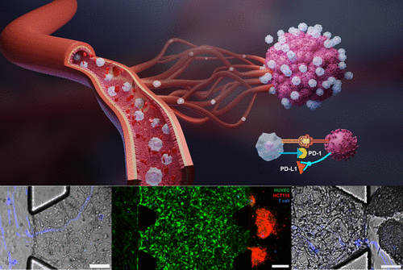

---

##### Download

+ [Paper](paper10.pdf)
+ [Supplementary material](appendix10.pdf)
<!-- + [Code and data](https://github.com/khayrulbuet13/vessel-tumor-immune-transport) -->


---

##### Abstract

<div class="justify-text">
Observing and quantifying immune cell transport during cancer immunotherapy remains a challenge in the field. This paper presents an advanced 3D vessel-tumor model to study T cell transport and interaction with tumors in vitro. Using a coarse-grained molecular dynamics model with the Cooke-Deserno membrane representation technique, the study simulated the influence of vascular glycocalyx (VGCX) on ligand-receptor binding between T cells and endothelial cells. Results demonstrated the significant effect of the endothelial glycocalyx on T cell transport and evaluated the impact of PD-1 inhibition on tumor killing. These findings provide critical insights into immune cell transport dynamics during cancer immunotherapy, advancing the understanding of tumor-immune interactions.
</div>

---


##### Figure 1: Microphysiologically engineered vessel-tumor model



---

##### Citation

Zhao, Yuwen, Yue Wu, Khayrul Islam, Ratul Paul, Yuyuan Zhou, Xiaochen Qin, Qiying Li, and Yaling Liu. 2024. "Microphysiologically engineered vessel-tumor model to investigate vascular transport dynamics of immune cells." *ACS Applied Materials & Interfaces* 16 (18): 22839–22849. https://pubs.acs.org/doi/full/10.1021/acsami.4c00391.

```BibTeX
@article{Zhao24,
author = {Yuwen Zhao, Yue Wu, Khayrul Islam, Ratul Paul, Yuyuan Zhou, Xiaochen Qin, Qiying Li, Yaling Liu},
year = {2024},
title = {Microphysiologically engineered vessel-tumor model to investigate vascular transport dynamics of immune cells},
journal = {ACS Applied Materials & Interfaces},
volume = {16},
number = {18},
pages = {22839--22849},
doi = {10.1021/acsami.4c00391},
url = {https://pubs.acs.org/doi/full/10.1021/acsami.4c00391}}
```

---