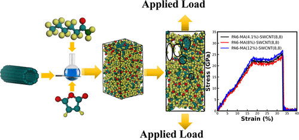

---

##### Download

+ [Paper](paper11.pdf)
<!-- + [Supplementary material](appendix11.pdf) -->
<!-- + [Code and data](https://github.com/khayrulbuet13/polyamide-nanocomposites) -->


---

##### Abstract

<div class="justify-text">
Enhancing the mechanical properties of polyamide nanocomposites is crucial for various industrial applications. This study investigates the synergistic effects of single-walled carbon nanotube (SWCNT) chirality and maleic anhydride (MA) grafting using molecular dynamics simulations. Our results demonstrate that the mechanical strength of the nanocomposites improves significantly at optimal MA concentrations, with specific SWCNT chirality playing a key role in this enhancement. These findings provide critical insights for designing stronger polyamide nanocomposites through effective reinforcement strategies.
</div>

---


##### Figure 1: Polyamide nanocomposites with SWCNT



---

##### Citation

Hasan, Mehedi, Khayrul Islam, and A K M Masud. 2024. "Tailoring polyamide nanocomposites: The synergistic effects of SWCNT chirality and maleic anhydride grafting." *ACS Applied Engineering Materials* 2 (6): 1593–1602. https://pubs.acs.org/doi/full/10.1021/acsaenm.4c00155.

```BibTeX
@article{Hasan24,
author = {Mehedi Hasan, Khayrul Islam, A K M Masud},
year = {2024},
title = {Tailoring polyamide nanocomposites: The synergistic effects of SWCNT chirality and maleic anhydride grafting},
journal = {ACS Applied Engineering Materials},
volume = {2},
number = {6},
pages = {1593--1602},
doi = {10.1021/acsaenm.4c00155},
url = {https://pubs.acs.org/doi/full/10.1021/acsaenm.4c00155}}
```

---