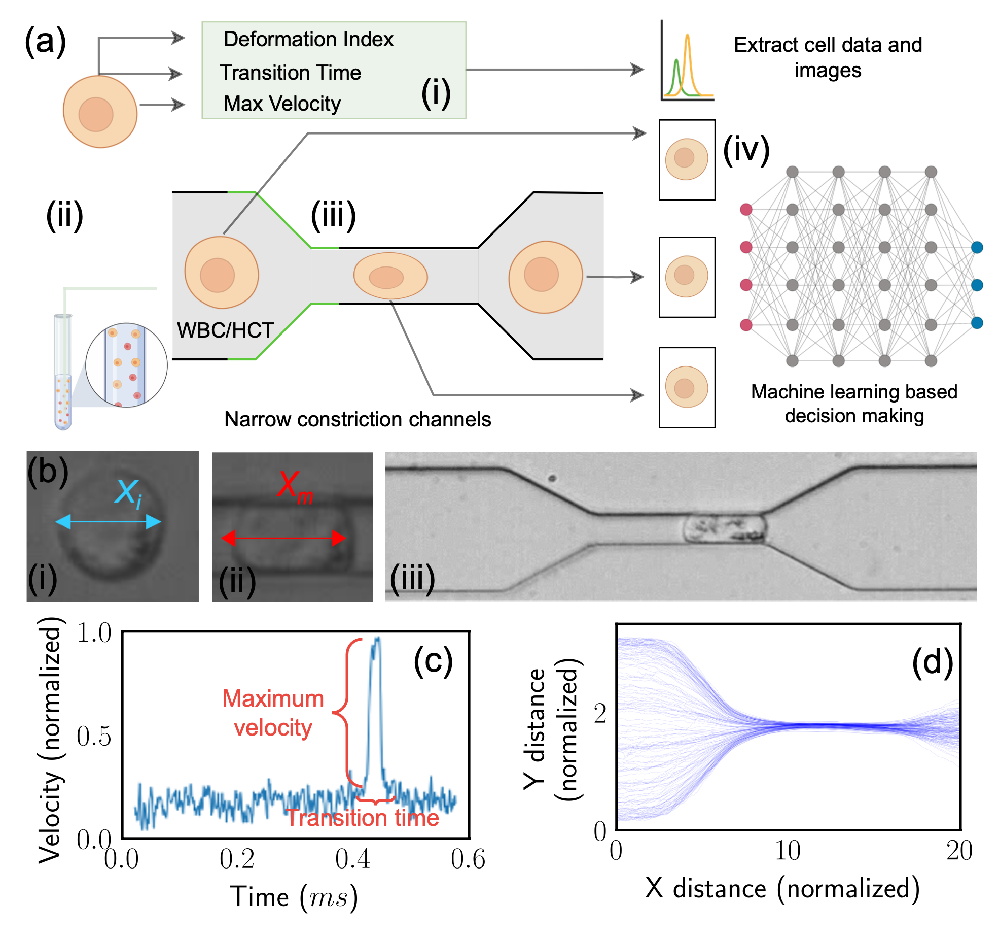

---

##### Under Review

<!-- + [Paper](paper12.pdf)
+ [Supplementary material](appendix12.pdf) -->
<!-- + [Code and data](https://github.com/khayrulbuet13/MIML-cell-classification) -->


---

##### Abstract

<div class="justify-text">
Label-free cell classification is advantageous for supplying pristine cells for further use or examina- tion, yet existing techniques frequently fall short in terms of specificity and speed. In this study, we address these limitations through the development of a novel machine learning framework, Mul- tiplex Image Machine Learning (MIML). This architecture uniquely combines label-free cell images with biomechanical property data, harnessing the vast, often underutilized morphological informa- tion intrinsic to each cell. By integrating both types of data, our model offers a more holistic understanding of the cellular properties, utilizing morphological information typically discarded in traditional machine learning models. This approach has led to a remarkable 98.3% accuracy in cell classification, a substantial improvement over models that only consider a single data type. MIML has been proven effective in classifying white blood cells and tumor cells, with potential for broader application due to its inherent flexibility and transfer learning capability. It’s particularly effective for cells with similar morphology but distinct biomechanical properties. This innovative approach has significant implications across various fields, from advancing disease diagnostics to understanding cellular behavior.
</div>

---


##### Figure 1: Multiplex Image Machine Learning (MIML)



---

##### Citation

Islam, Khayrul, Ratul Paul, Shen Wang, Yuwen Zhao, Partho Adhikary, Qiying Li, Xiaochen Qin, and Yaling Liu. "MIML: Multiplex Image Machine Learning for High Precision Cell Classification via Mechanical Traits within Microfluidic Systems." *Under review*. https://arxiv.org/abs/2309.08421.

```BibTeX
@article{Islam24,
author = {Khayrul Islam, Ratul Paul, Shen Wang, Yuwen Zhao, Partho Adhikary, Qiying Li, Xiaochen Qin, Yaling Liu},
year = {},
title = {MIML: Multiplex Image Machine Learning for High Precision Cell Classification via Mechanical Traits within Microfluidic Systems},
journal = {Under review},
doi = {10.48550/arXiv.2309.08421},
url = {https://arxiv.org/abs/2309.08421}}
```

---