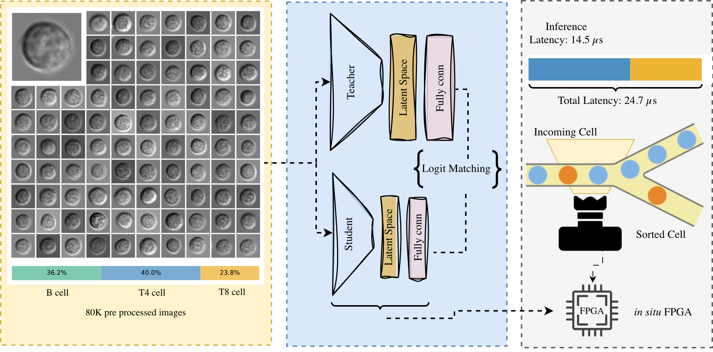

---

##### Download

+ [Paper](https://pubs.rsc.org/en/content/articlelanding/2025/dd/d5dd00345h)
+ [Supplementary Materials](https://www.rsc.org/suppdata/d5/dd/d5dd00345h/d5dd00345h1.pdf)
+ [arXiv](https://arxiv.org/html/2503.12622v1)
+ [GitHub Repository - LymphoML](https://github.com/Khayrulbuet13/LymphoML)
+ [Dataset - LymphoMNIST](https://github.com/Khayrulbuet13/LymphoMNIST)

---

##### Abstract

<div class="justify-text">

Precise cell classification is essential in biomedical diagnostics and therapeutic monitoring, particularly for identifying diverse cell types involved in various diseases. Traditional cell classification methods, such as flow cytometry, depend on molecular labeling, which is often costly, time-intensive, and can alter cell integrity. Real-time microfluidic sorters also impose a sub-ms decision window that existing machine-learning pipelines cannot meet. To overcome these limitations, we present a label-free machine learning framework for cell classification, designed for real-time sorting applications using bright-field microscopy images. This approach leverages a teacher–student model architecture enhanced by knowledge distillation, achieving high efficiency and scalability across different cell types. Demonstrated through a use case of classifying lymphocyte subsets, our framework accurately classifies T4, T8, and B cell types with a dataset of 80,000 pre-processed images, released publicly as the LymphoMNIST package for reproducible benchmarking. Our teacher model attained 98% accuracy in differentiating T4 cells from B cells and 93% accuracy in zero-shot classification between T8 and B cells. Remarkably, our student model operates with only 5,682 parameters (∼0.02% of the teacher, a 5000-fold reduction), enabling field-programmable gate array (FPGA) deployment. Implemented directly on the frame-grabber FPGA as the first demonstration of in situ deep learning in this setting, the student model achieves an ultra-low inference latency of just 14.5 µs and a complete cell detection-to-sorting trigger time of 24.7 µs, delivering 12× and 40× improvements over the previous state of the art in inference and total latency, respectively, while preserving accuracy comparable to the teacher model. This framework establishes the first sub-25 µs ML benchmark for label-free cytometry and provides an open, cost-effective blueprint for upgrading existing imaging sorters.

</div>

---

##### Key Highlights

+ **Label-Free Classification**: Eliminates costly molecular labeling through bright-field microscopy
+ **LymphoMNIST Dataset**: 80,000 pre-processed images publicly available via pip install
+ **Knowledge Distillation**: Student model with only 5,682 parameters (0.02% of teacher)
+ **Ultra-Low Latency**: 14.5 µs inference time on FPGA, 40× faster than previous state of the art
+ **Transfer Learning**: 93% accuracy in zero-shot T8–B cell classification
+ **Real-Time Deployment**: First demonstration of in situ deep learning on frame-grabber FPGA

---

##### Dataset: LymphoMNIST

<div class="justify-text">

We created LymphoMNIST, a dataset of 80,000 high-resolution bright-field images of lymphocyte cells, including T4, T8, and B cells. Each image is carefully preprocessed and standardized to enhance model training and generalization across different conditions. To ensure balanced and effective training, the dataset is split into 80% for training, 10% for validation, and 10% for testing.

The dataset is publicly available and can be installed using:

</div>

```bash
pip install LymphoMNIST
```

Explore the dataset details on the [LymphoMNIST GitHub](https://github.com/Khayrulbuet13/LymphoMNIST) and the full implementation on the [LymphoML GitHub](https://github.com/Khayrulbuet13/LymphoML).

---

##### Figure 1: Weight Space Learning Diagram



---

##### Citation

Islam, Khayrul, Ryan F. Forelli, Jianzhong Han, Deven Bhadane, Jian Huang, Joshua C. Agar, Nhan Tran, Seda Ogrenci, and Yaling Liu. 2025. "Real-Time Cell Sorting with Scalable In Situ FPGA-Accelerated Deep Learning." *Digital Discovery*. https://doi.org/10.1039/D5DD00345H.

```BibTeX
@article{islam2025realtime,
  title={Real-Time Cell Sorting with Scalable In Situ FPGA-Accelerated Deep Learning},
  author={Islam, Khayrul and Forelli, Ryan F. and Han, Jianzhong and Bhadane, Deven and Huang, Jian and Agar, Joshua C. and Tran, Nhan and Ogrenci, Seda and Liu, Yaling},
  journal={Digital Discovery},
  year={2025},
  doi={10.1039/D5DD00345H},
  url={http://dx.doi.org/10.1039/D5DD00345H}
}
```

---

##### Affiliations

1. Lehigh University, Bethlehem, PA, USA
2. Northwestern University, Evanston, IL, USA
3. Coriell Institute for Medical Research, Camden, NJ, USA
4. Cooper Medical School of Rowan University, Camden, NJ, USA
5. Center for Metabolic Disease Research, Temple University, Philadelphia, PA, USA
6. Drexel University, Philadelphia, PA, USA
7. Fermi National Accelerator Laboratory, Batavia, IL, USA

---

##### Acknowledgments

Supported by the National Science Foundation (NSF).

