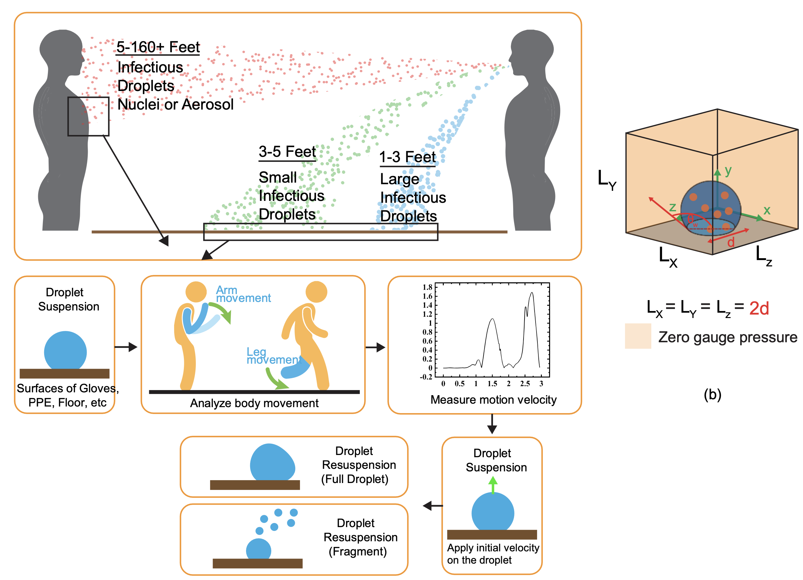

---

##### Download

+ [Paper](paper2.pdf)
+ [Supplementary material](appendix2.pdf)
<!-- + [Code and data](https://github.com/khayrulbuet13/respiratory-droplet-resuspension) -->


---

##### Abstract

<div class="justify-text">
Knowing the environmental spreading pathway of COVID-19 is crucial for improving safety practices, particularly for health care workers who are more susceptible to exposure. This paper focuses on the possible secondary transmission due to resuspension of virus-laden droplets from common surfaces, which several studies have shown to be possible under external disturbances. Such disturbances could be body motion during walking, running, clothes removal, or airflow in the environment. In this paper, a three-dimensional two-phase model is utilized to study respiratory droplet resuspension dynamics on various surfaces due to sudden agitation. The velocity range and variation during walking, surgical glove removal, and dropping an object are studied experimentally. A parametric study is performed to characterize the effects of droplet size and surface wettability on the minimum initial droplet velocity required for detachment from surfaces. The results are reported as average droplet velocity during the detachment process, total detachment time, and detached droplet volume. The obtained results indicate that respiratory droplets larger than 200 μm can detach from typical surfaces due to normal daily activities. Droplets are partially separated from hydrophilic surfaces with contact angle ⁠, while the entire droplet is detached from hydrophobic surfaces with contact angle ⁠. Furthermore, the minimum initial droplet velocity to induce the resuspension depends on the droplet size. Droplet velocity immediately after detachment is a function of droplet size, initial droplet velocity, and surface wettability. Bigger droplets have larger detached volume percentage as well as higher velocity after detachment compared to smaller droplets. Finally, a higher initial velocity is needed to separate droplets from hydrophilic surfaces as compared to hydrophobic surfaces. In accordance with the results, the droplet minimum initial velocity to cause detachment is 2 m s−1, while our experiments show that surface velocity can reach up to 3 m s−1 during normal human activities. We also develop an analytical model to predict the required kinetic energy to detach droplets from different surfaces, which is in good agreement with numerical results. The mechanism of droplet detachment is dictated by a competition between droplet kinetic energy induced by surface motion and surface energy due to droplet–surface interaction as well as droplet–vapor and surface–vapor interactions. We believe that the results of this fundamental study can potentially be used to suggest proper surface wettability and safe motion that reduce respiratory droplet resuspension from various surfaces.
</div>

---


##### Figure 1: Respiratory droplet resuspension



---

##### Citation

Nikfar, Mehdi, Ratul Paul, Khayrul Islam, Meghdad Razizadeh, Anand Jagota, and Yaling Liu. 2021. "Respiratory droplet resuspension near surfaces: Modeling and analysis." *Journal of Applied Physics* 130 (2): 024702. https://aip.scitation.org/doi/abs/10.1063/5.0050447.

```BibTeX
@article{Nikfar21,
author = {Mehdi Nikfar, Ratul Paul, Khayrul Islam, Meghdad Razizadeh, Anand Jagota, Yaling Liu},
year = {2021},
title = {Respiratory droplet resuspension near surfaces: Modeling and analysis},
journal = {Journal of Applied Physics},
volume = {130},
number = {2},
pages = {024702},
doi = {10.1063/5.0050447},
url = {https://aip.scitation.org/doi/abs/10.1063/5.0050447}}
```

---

##### Related material -->

<!-- + [Presentation slides](presentation1.pdf)
+ [Summary of the paper](https://www.penguinrandomhouse.com/books/110403/unusual-uses-for-olive-oil-by-alexander-mccall-smith/)
