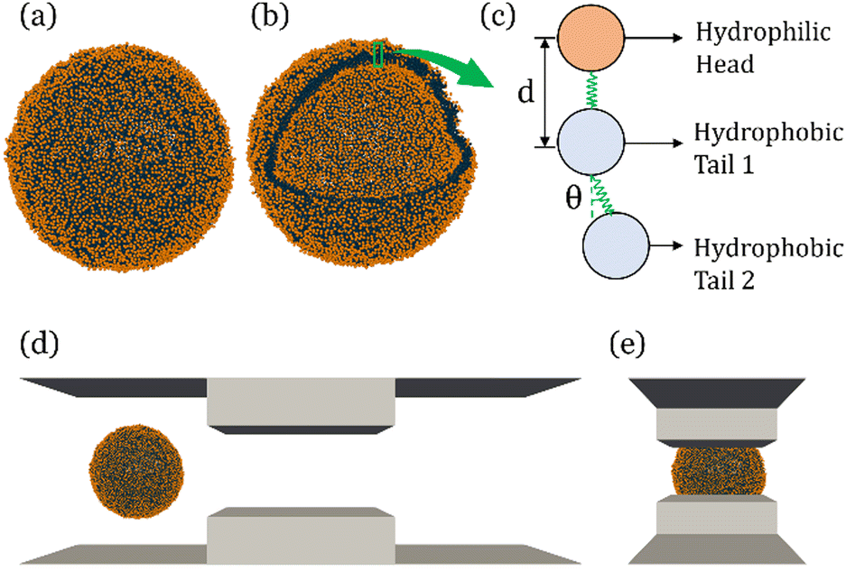

---

##### Download

+ [Paper](paper5.pdf)
+ [Supplementary material](appendix5.pdf)
<!-- + [Code and data](https://github.com/khayrulbuet13/molecular-simulation-ev-squeezing) -->


---

##### Abstract

<div class="justify-text">
In recent years, extracellular vesicles have become promising carriers as next-generation drug delivery platforms. Effective loading of exogenous cargos without compromising the extracellular vesicle membrane is a major challenge. Rapid squeezing through nanofluidic channels is a widely used approach to load exogenous cargoes into the EV through the nanopores generated temporarily on the membrane. However, the exact mechanism and dynamics of nanopore opening, as well as cargo loading through nanopores during the squeezing process remains unknown and it is impossible to visualize or quantify it experimentally due to the small size of the EV and the fast transient process. This paper developed a systemic algorithm to simulate nanopore formation and predict drug loading during extracellular vesicle (EV) squeezing by leveraging the power of coarse-grain (CG) molecular dynamics simulations with fluid dynamics. The EV CG beads are coupled with implicit the fluctuating lattice Boltzmann solvent. The effects of EV properties and various squeezing test parameters, such as EV size, flow velocity, channel width, and length, on pore formation and drug loading efficiency are analyzed. Based on the simulation results, a phase diagram is provided as a design guide for nanochannel geometry and squeezing velocity to generate pores on the membrane without damaging the EV. This method can be utilized to optimize the nanofluidic device configuration and flow setup to obtain desired drug loading into EVs.
</div>

---


##### Figure 1: Molecular simulation of EV squeezing for drug loading



---

##### Citation

Islam, Khayrul, Meghdad Razizadeh, and Yaling Liu. 2023. "Coarse-grained molecular simulation of extracellular vesicle squeezing for drug loading." *Physical Chemistry Chemical Physics* 25 (17): 12308–12321. https://pubs.rsc.org/en/content/articlehtml/2023/cp/d3cp00387f.

```BibTeX
@article{Islam23,
author = {Khayrul Islam, Meghdad Razizadeh, Yaling Liu},
year = {2023},
title = {Coarse-grained molecular simulation of extracellular vesicle squeezing for drug loading},
journal = {Physical Chemistry Chemical Physics},
volume = {25},
number = {17},
pages = {12308--12321},
doi = {10.1039/d3cp00387f},
url = {https://pubs.rsc.org/en/content/articlehtml/2023/cp/d3cp00387f}}
```

---