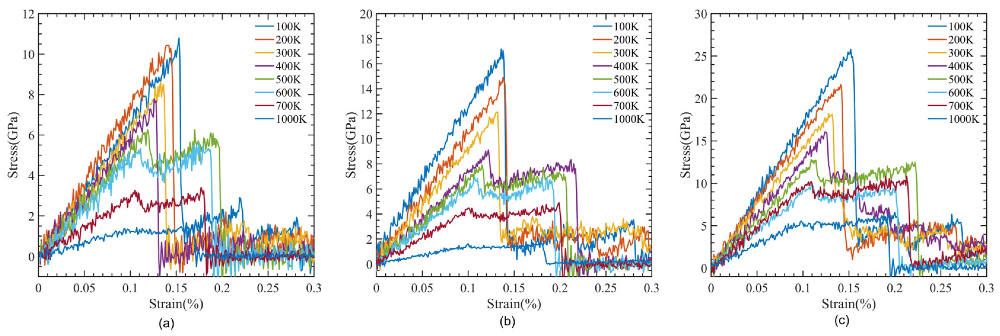

---

##### Download

+ [Paper](paper6.pdf)
<!-- + [Supplementary material](appendix6.pdf) -->
<!-- + [Code and data](https://github.com/khayrulbuet13/CNT-PMMA-tensile-deformation) -->


---

##### Abstract

<div class="justify-text">
There has been growing interest in polymer/carbon nanotube (CNT) composites due to an exceptional enhancement in mechanical, structural, thermal, and electronic properties resulting from a small percentage of CNTs. However, the performance of these composites is influenced by the type of polymer used. PMMA is a polymer of particular interest among many other polymers because of its biomaterial applications due to its biocompatibility, non-toxicity, and non-biodegradability. In this research, we utilized a reactive force field to conduct molecular dynamics simulations to investigate changes in the mechanical properties of single-walled carbon nanotube (SWCNT)-reinforced Poly (methyl methacrylate) (PMMA) matrix composites. To explore the potential of SWCNT-reinforced PMMA composites in these applications, we conducted simulations with varying CNT diameters (0.542–1.08 nm), CNT volume fractions (8.1–16.5%), and temperatures (100 K–700 K). We also analyzed the dependence of Young’s modulus and interaction energy with different CNT diameters, along with changes in fracture toughness with varying temperatures. Our findings suggest that incorporating a small amount of SWCNT into the PMMA polymer matrix could significantly enhance the mechanical properties of the resulting composite. It is also found that the double-walled carbon nanotube has roughly twice the tensile strength of SWCNT, while maintaining the same simulation cell dimensions.
</div>

---


##### Figure 1: Tensile deformation of CNT-PMMA composites



---

##### Citation

Raj, Anshu, Sk Md Ahnaf Akif Alvi, Khayrul Islam, Mohammad Motalab, and Shuozhi Xu. 2023. "An atomistic study of the tensile deformation of carbon nanotube-polymethylmethacrylate composites." *Polymers* 15 (13): 2956. https://www.mdpi.com/2073-4360/15/13/2956.

```BibTeX
@article{Raj23,
author = {Anshu Raj, Sk Md Ahnaf Akif Alvi, Khayrul Islam, Mohammad Motalab, Shuozhi Xu},
year = {2023},
title = {An atomistic study of the tensile deformation of carbon nanotube-polymethylmethacrylate composites},
journal = {Polymers},
volume = {15},
number = {13},
pages = {2956},
doi = {10.3390/polym15132956},
url = {https://www.mdpi.com/2073-4360/15/13/2956}}
```

---