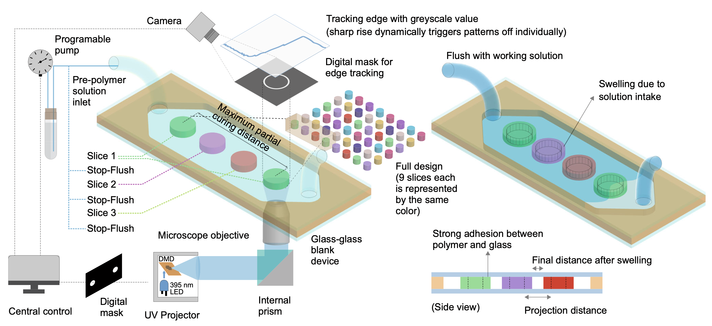

---

##### Download

+ [Paper](paper7.pdf)
+ [Supplementary material](appendix7.pdf)
+ [Supplementary Movie 1](https://static-content.springer.com/esm/art%3A10.1038%2Fs41467-023-40119-x/MediaObjects/41467_2023_40119_MOESM3_ESM.avi)

+ [Supplementary Movie 2](https://static-content.springer.com/esm/art%3A10.1038%2Fs41467-023-40119-x/MediaObjects/41467_2023_40119_MOESM4_ESM.avi)

+ [Supplementary Movie 3](https://static-content.springer.com/esm/art%3A10.1038%2Fs41467-023-40119-x/MediaObjects/41467_2023_40119_MOESM5_ESM.avi)

+ [Supplementary Movie 4](https://static-content.springer.com/esm/art%3A10.1038%2Fs41467-023-40119-x/MediaObjects/41467_2023_40119_MOESM6_ESM.avi)

+ [Supplementary Movie 5](https://static-content.springer.com/esm/art%3A10.1038%2Fs41467-023-40119-x/MediaObjects/41467_2023_40119_MOESM7_ESM.avi)

+ [Supplementary Movie 6](https://static-content.springer.com/esm/art%3A10.1038%2Fs41467-023-40119-x/MediaObjects/41467_2023_40119_MOESM8_ESM.avi)

+ [Supplementary Movie 7](https://static-content.springer.com/esm/art%3A10.1038%2Fs41467-023-40119-x/MediaObjects/41467_2023_40119_MOESM9_ESM.avi)


---

##### Abstract

<div class="justify-text">
Microfluidic devices have found extensive applications in mechanical, bio- medical, chemical, and materials research. However, the high initial cost, low resolution, inferior feature fidelity, poor repeatability, rough surface finish, and long turn-around time of traditional prototyping methods limit their wider adoption. In this study, a strategic approach to a deterministic fabrication process based on in-situ image analysis and intermittent flow control called image-guided in-situ maskless lithography (IGIs-ML), has been proposed to overcome these challenges. By using dynamic image analysis and integrated flow control, IGIs-ML provides superior repeatability and fidelity of densely packed features across a large area and multiple devices. This general and robust approach enables the fabrication of a wide variety of microfluidic devices and resolves critical proximity effect and size limitations in rapid prototyping. The affordability and reliability of IGIs-ML make it a powerful tool for exploring the design space beyond the capabilities of traditional rapid prototyping.
</div>

---


##### Figure 1: Maskless image guided microfluidic prototyping



---

##### Citation

Paul, Ratul, Yuwen Zhao, Declan Coster, Xiaochen Qin, Khayrul Islam, Yue Wu, and Yaling Liu. 2023. "Rapid prototyping of high-resolution large format microfluidic device through maskless image guided in-situ photopolymerization." *Nature Communications* 14 (1): 4520. https://www.nature.com/articles/s41467-023-40119-x.

```BibTeX
@article{Paul23,
author = {Ratul Paul, Yuwen Zhao, Declan Coster, Xiaochen Qin, Khayrul Islam, Yue Wu, Yaling Liu},
year = {2023},
title = {Rapid prototyping of high-resolution large format microfluidic device through maskless image guided in-situ photopolymerization},
journal = {Nature Communications},
volume = {14},
number = {1},
pages = {4520},
doi = {10.1038/s41467-023-40119-x},
url = {https://www.nature.com/articles/s41467-023-40119-x}}
```

---

<!-- ##### Related material

<!-- + [Presentation slides](presentation1.pdf) -->


