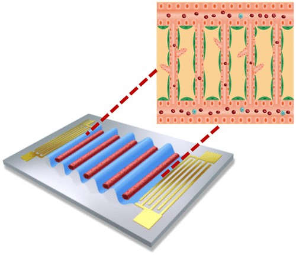

---

##### Download

+ [Paper](paper8.pdf)
+ [Supplementary material](appendix8.pdf)
<!-- + [Code and data](https://github.com/khayrulbuet13/acoustofluidic-vessel-on-a-chip) -->


---

##### Abstract

<div class="justify-text">
Construction of in vitro vascular models is of great significance to various biomedical research, such as pharmacokinetics and hemodynamics, and thus is an important direction in the tissue engineering field. In this work, a standing surface acoustic wave field was constructed to spatially arrange suspended endothelial cells into a designated acoustofluidic pattern. The cell patterning was maintained after the acoustic field was withdrawn within the solidified hydrogel. Then, interstitial flow was provided to activate vessel tube formation. In this way, a functional vessel network with specific vessel geometry was engineered on-chip. Vascular function, including perfusability and vascular barrier function, was characterized by microbead loading and dextran diffusion, respectively. A computational atomistic simulation model was proposed to illustrate how solutes cross the vascular membrane lipid bilayer. The reported acoustofluidic methodology is capable of facile and reproducible fabrication of the functional vessel network with specific geometry and high resolution. It is promising to facilitate the development of both fundamental research and regenerative therapy.
</div>

---


##### Figure 1: Acoustofluidic vessel-on-a-chip engineering



---

##### Citation

Wu, Yue, Yuwen Zhao, Khayrul Islam, Yuyuan Zhou, Saeed Omidi, Yevgeny Berdichevsky, and Yaling Liu. 2023. "Acoustofluidic engineering of functional vessel-on-a-chip." *ACS Biomaterials Science & Engineering* 9 (11): 6273–6281. http://dx.doi.org/10.1021/acsbiomaterials.3c00925.

```BibTeX
@article{Wu23b,
author = {Yue Wu, Yuwen Zhao, Khayrul Islam, Yuyuan Zhou, Saeed Omidi, Yevgeny Berdichevsky, Yaling Liu},
year = {2023},
title = {Acoustofluidic engineering of functional vessel-on-a-chip},
journal = {ACS Biomaterials Science & Engineering},
volume = {9},
number = {11},
pages = {6273--6281},
doi = {10.1021/acsbiomaterials.3c00925},
url = {http://dx.doi.org/10.1021/acsbiomaterials.3c00925}}
```

---