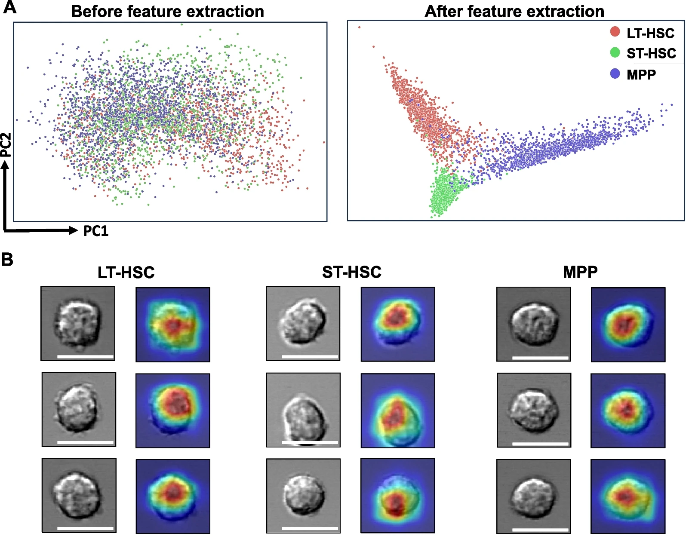

---

##### Download

+ [Paper](paper9.pdf)
+ [Supplementary material](appendix9.pdf)
<!-- + [Code and data](https://github.com/khayrulbuet13/deep-learning-HSC-classification) -->


---

##### Abstract

<div class="justify-text">
Hematopoietic stem cells (HSCs) and multipotent progenitors (MPPs) play a pivotal role in maintaining lifelong hematopoiesis. The distinction between stem cells and other progenitors, as well as the assessment of their functions, has long been a central focus in stem cell research. In recent years, deep learning has emerged as a powerful tool for cell image analysis and classification/prediction. In this study, we explored the feasibility of employing deep learning techniques to differentiate murine HSCs and MPPs based solely on their morphology, as observed through light microscopy (DIC) images. After rigorous training and validation using extensive image datasets, we successfully developed a three-class classifier, referred to as the LSM model, capable of reliably distinguishing long-term HSCs, short-term HSCs, and MPPs. The LSM model extracts intrinsic morphological features unique to different cell types, irrespective of the methods used for cell identification and isolation, such as surface markers or intracellular GFP markers. Furthermore, employing the same deep learning framework, we created a two-class classifier that effectively discriminates between aged HSCs and young HSCs. This discovery is particularly significant as both cell types share identical surface markers yet serve distinct functions. This classifier holds the potential to offer a novel, rapid, and efficient means of assessing the functional states of HSCs, thus obviating the need for time-consuming transplantation experiments. Our study represents the pioneering use of deep learning to differentiate HSCs and MPPs under steady-state conditions. This novel and robust deep learning-based platform will provide a basis for the future development of a new generation stem cell identification and separation system. It may also provide new insight into the molecular mechanisms underlying stem cell self-renewal.
</div>

---


##### Figure 1: Deep learning-based classification of hematopoietic stem cells



---

##### Citation

Wang, Shen, Jianzhong Han, Jingru Huang, Khayrul Islam, Yuheng Shi, Yuyuan Zhou, Dongwook Kim, Jane Zhou, Zhaorui Lian, Yaling Liu, and Jian Huang. 2024. "Deep learning-based predictive classification of functional subpopulations of hematopoietic stem cells and multipotent progenitors." *Stem Cell Research & Therapy* 15 (1): 74. https://stemcellres.biomedcentral.com/articles/10.1186/s13287-024-03682-8.

```BibTeX
@article{Wang24,
author = {Shen Wang, Jianzhong Han, Jingru Huang, Khayrul Islam, Yuheng Shi, Yuyuan Zhou, Dongwook Kim, Jane Zhou, Zhaorui Lian, Yaling Liu, Jian Huang},
year = {2024},
title = {Deep learning-based predictive classification of functional subpopulations of hematopoietic stem cells and multipotent progenitors},
journal = {Stem Cell Research & Therapy},
volume = {15},
number = {1},
pages = {74},
doi = {10.1186/s13287-024-03682-8},
url = {https://stemcellres.biomedcentral.com/articles/10.1186/s13287-024-03682-8}}
```

---